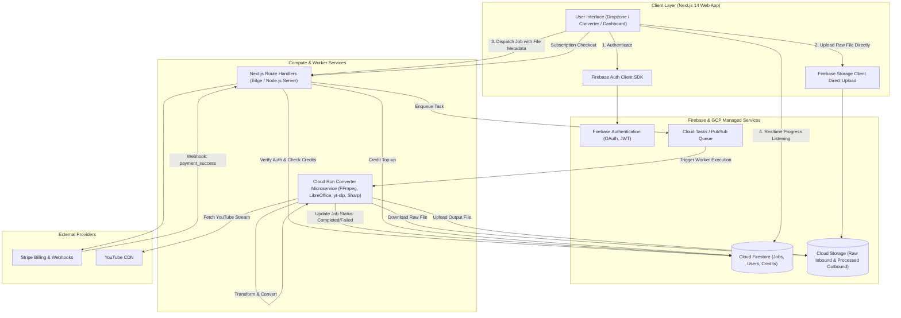
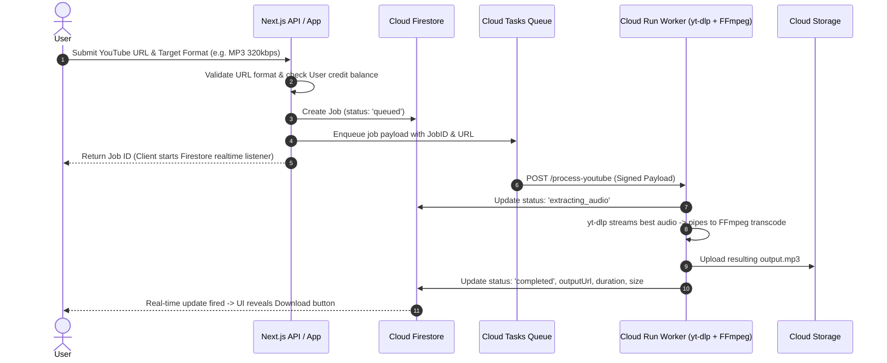

# System Architecture & Flow

This document details the high-level architecture, component breakdown, and end-to-end data lifecycle for **ConvertFlow**.

---

## 1. High-Level Architecture Diagram

---

## 2. Core Architectural Pillars

### Pillar A: Direct-to-Storage Upload Pattern
- Standard server uploads struggle with large 100MB+ audio/video/document files due to Vercel/Next.js body size limits (typically 4.5MB on serverless).
- **ConvertFlow Solution**: The client requests a signed upload URL from Firebase or uses the Firebase Client SDK with storage rules to upload directly to `gs://convertflow-uploads/{userId}/{jobId}/input.*`.
- This ensures zero server memory bottleneck and maximum network throughput.

### Pillar B: Decoupled Heavy Conversion Engine (Cloud Run)
- Heavy operations (FFmpeg audio transcoding, LibreOffice PDF conversion, `yt-dlp` stream extraction) cannot run within serverless Next.js functions due to CPU timeouts (10–60s) and binary dependency sizes.
- **ConvertFlow Solution**: Deploy a dedicated Docker container onto **Google Cloud Run** with autoscaling (0 to N instances).
- The container includes:
  - `ffmpeg` (with libmp3lame, libopus, aac)
  - `yt-dlp` (kept auto-updated via build pipelines)
  - `libreoffice-headless` + `poppler-utils` + `pandoc`
  - `sharp` / `imagemagick` for high-throughput raster & vector images.

### Pillar C: Event-Driven State & Real-Time UX
- Instead of periodic client HTTP polling, the frontend subscribes to `onSnapshot(doc(db, "jobs", jobId))`.
- The worker reports granular progression:
  - `0%`: Job queued
  - `20%`: Input fetched & validated
  - `60%`: Transcoding / processing in progress
  - `90%`: Uploading converted artifact
  - `100%`: Completed + signed download link generated.

### Pillar D: Transient Storage & Privacy-First Data Retention
- To maintain strict privacy and minimize GCP storage costs, files are saved with a TTL.
- A Cloud Storage **Lifecycle Rule** automatically deletes objects in `gs://convertflow-uploads/*` and `gs://convertflow-outputs/*` after 24 hours.
- Download URLs are generated as time-bound Signed URLs (1 hour validity).

---

## 3. YouTube Extraction Architecture & Policy Safeguards

### Safety & Reliability Mitigations:
1. **Proxy Rotation / IP Protection**: High-volume `yt-dlp` invocations can face YouTube rate limits. Cloud Run workers should utilize residential/datacenter proxy middleware if scaling commercially.
2. **Duration Caps**: Free users restricted to $\le 10$ minutes video length; Pro users up to 120 minutes.
3. **Format Filter**: Disallow full video remuxing if only audio extraction is requested, drastically saving bandwidth and memory.
