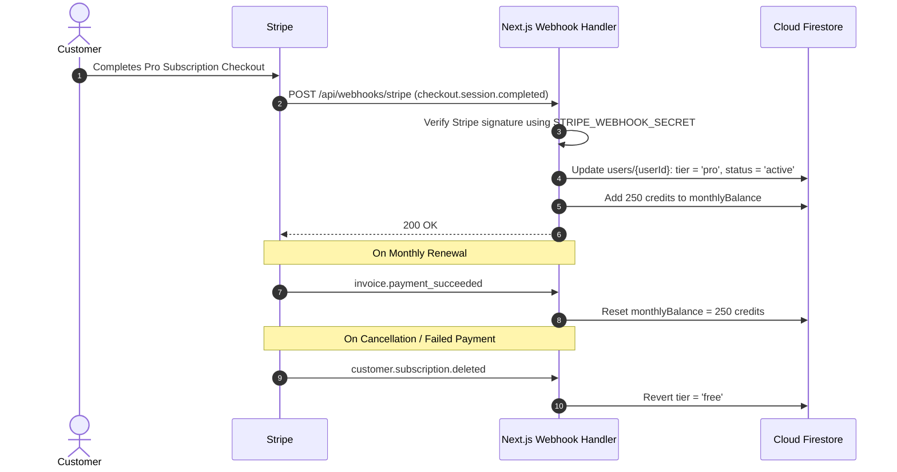

# SaaS Pricing, Authentication & Monetization Architecture

This document defines the user tier boundaries, credit unit calculations, Stripe billing flow, and authentication mechanisms for **ConvertFlow**.

---

## 1. Plan Comparison Matrix

| Feature | Free Tier | Pro Tier ($9.99/mo) | Enterprise ($29.99/mo) |
| :--- | :--- | :--- | :--- |
| **Monthly Conversions / Credits** | 10 credits / month | 250 credits / month | 1,500 credits / month |
| **Max File Size** | 25 MB | 500 MB | 2 GB |
| **Concurrent Jobs** | 1 file at a time | 5 files at a time | 20 files (Batch Mode) |
| **YouTube Extraction Length** | Up to 10 minutes | Up to 120 minutes | Unlimited |
| **Audio Quality Output** | 128 kbps | Up to 320 kbps (Lossless WAV) | 320 kbps & Studio Lossless |
| **OCR for PDF / Scanned Docs** | ❌ | ✅ (Up to 50 pages) | ✅ (Unlimited) |
| **Ad-free Experience** | ❌ (Ad-supported) | ✅ Ad-free | ✅ Ad-free + Dedicated API |
| **File Storage Retention** | 1 hour | 24 hours | 7 days custom |

---

## 2. Credit Calculation Formula

To protect against compute-heavy conversions draining infrastructure margins:

| Operation | Credit Cost |
| :--- | :--- |
| Standard Image Conversion (JPG $\leftrightarrow$ PNG $\leftrightarrow$ WEBP) | **1 Credit** |
| Standard Document Conversion (DOCX $\leftrightarrow$ PDF $\le 10$ pages) | **1 Credit** |
| Document with OCR ($\gt 10$ pages) | **2 Credits** per 25 pages |
| Audio Transcoding (WAV $\rightarrow$ MP3 $\le 10$ min) | **1 Credit** |
| Long Audio Transcoding ($10$–$60$ min) | **2 Credits** |
| YouTube to MP3/WAV Extraction ($\le 15$ min) | **1 Credit** |
| YouTube to MP3/WAV Extraction ($15$–$60$ min) | **2 Credits** |

---

## 3. Stripe Webhook Handling Flow

---

## 4. Firebase Authentication Strategy

1. **Social Login (Zero Friction)**:
   - Google One Tap / Firebase Google Auth Provider
   - GitHub Provider (popular for developer file tools)
2. **Passwordless Magic Links**:
   - For corporate and institutional users who avoid passwords.
3. **Anonymous Guest Sessions**:
   - `signInAnonymously()` allows guests to immediately convert files without signup friction.
   - When a guest decides to subscribe or save history, their anonymous account is upgraded seamlessly via `linkWithCredential()`.
